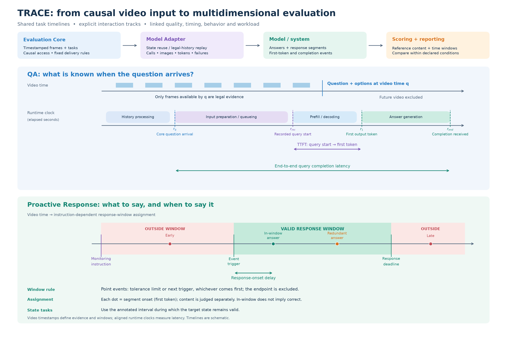
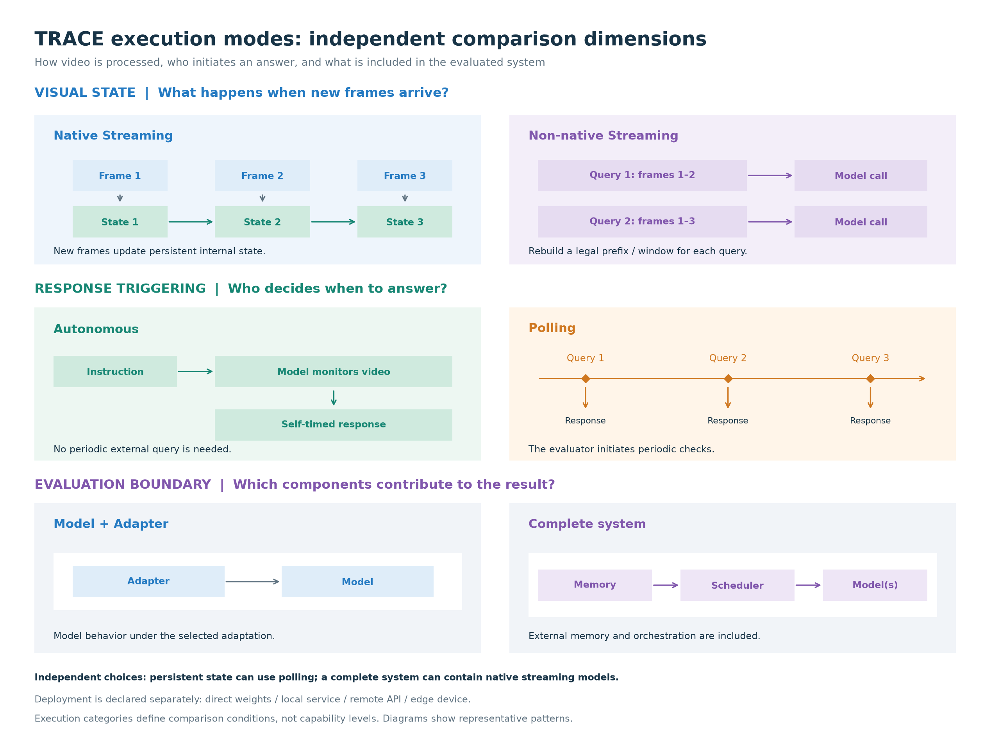

# TRACE: Temporal Audit and Condition-aware Evaluation of Streaming Video Understanding

English | [简体中文](README.zh-CN.md)

A local benchmark for timestamped video QA and proactive responses.
Download the source videos, connect a model through an adapter, and retain
raw outputs, timing, failures and scores. Real model evaluation normally requires
a GPU; TRACE does not host an online evaluator.

| Component | Version / scope |
| --- | --- |
| Software | `0.1.0` |
| Annotation snapshot | `data/releases/v1.1.0` |
| Full dataset | 833 QA, 415 Proactive records; 1,338 windows |
| Tiny setup subset | 9 QA + 9 Proactive records |
| Code / data | [MIT](LICENSE) / [data terms](DATA_TERMS.md) |

Only v1.1.0 annotations are included. Download videos and model weights separately.
See the [dataset card](docs/dataset-card.md) for populations and limitations.

## Tasks and research findings

QA asks a question at a specified time about the legal video history;
Proactive gives an instruction before an event and tests whether the model responds
when the visual condition holds. TRACE reports quality, timeliness, extra responses,
workload and execution reliability together.

### Cross-task scorecard

<table>
<thead>
<tr><th rowspan="2">Model configuration</th><th colspan="2">QA · 833 records</th><th colspan="5">Proactive · 1,270 windows</th></tr>
<tr><th>Accuracy ↑</th><th>Completion ↑</th><th>SWA ↑</th><th>TCR@5s ↑</th><th>Completion ↑</th><th>Redundant ↓</th><th>Outside-window ↓</th></tr>
</thead>
<tbody>
<tr><td colspan="8"><strong>Autonomous model + adapter</strong></td></tr>
<tr><td>LiveCC</td><td align="right">65.19%</td><td align="right">93.88%</td><td align="right">12.98%</td><td align="right">12.51%</td><td align="right">87.71%</td><td align="right">202.4</td><td align="right">562.0</td></tr>
<tr><td>MOSS-Preview</td><td align="right">65.07%</td><td align="right">100.00%</td><td align="right">4.45%</td><td align="right">4.31%</td><td align="right">100.00%</td><td align="right">68.3</td><td align="right">503.6</td></tr>
<tr><td>MOSS-VL</td><td align="right">75.03%</td><td align="right">99.88%</td><td align="right">8.05%</td><td align="right">7.50%</td><td align="right">100.00%</td><td align="right">185.6</td><td align="right">160.2</td></tr>
<tr><td>ThinkStream</td><td align="right">61.46%</td><td align="right">100.00%</td><td align="right">0.52%</td><td align="right">0.34%</td><td align="right">100.00%</td><td align="right">3.8</td><td align="right">29.4</td></tr>
<tr><td>VideoLLM-Online</td><td align="right">2.64%</td><td align="right">100.00%</td><td align="right">0.18%</td><td align="right">0.15%</td><td align="right">100.00%</td><td align="right">5.4</td><td align="right">45.0</td></tr>
<tr><td>AURA</td><td align="right">73.83%</td><td align="right">99.88%</td><td align="right">7.92%</td><td align="right">7.39%</td><td align="right">99.26%</td><td align="right">28.4</td><td align="right">188.1</td></tr>
<tr><td colspan="8"><strong>End-to-end autonomous system</strong></td></tr>
<tr><td>JoyAI</td><td align="right">67.47%</td><td align="right">91.36%</td><td align="right">17.08%</td><td align="right">15.18%</td><td align="right">95.58%</td><td align="right">74.6</td><td align="right">114.0</td></tr>
<tr><td colspan="8"><strong>Non-native polling baseline</strong></td></tr>
<tr><td>MiniCPM-O (polling)</td><td align="right">71.31%</td><td align="right">99.88%</td><td align="right">40.91%</td><td align="right">26.97%</td><td align="right">95.33%</td><td align="right">32.3</td><td align="right">215.8</td></tr>
</tbody>
</table>

Accuracy is the report's **Recoverable Accuracy**, not the current Core default
strict single-label score. Redundant and outside-window values are **counts per
100 target windows**, not probabilities. Groups follow Proactive interaction
boundaries, with no cross-group ranking. AURA uses non-native QA input; its
autonomous Proactive output does not certify native visual state.

[Interactive explorer: filters, sorting and trade-offs](docs/results-explorer.md) ·
[Full results, provenance and measurement limits](docs/benchmark-results.md)

This table uses retained v1.0.0 inference bundles analyzed on the v1.1.0 standard
population: Proactive covers 407 records / 1,270 windows with W=5s.
The default `--subset full` includes additional sampling-stress records and
must not be compared directly as the same population.

### Representative findings

**Similar QA scores can hide different completion and generation workload.**
LiveCC and MOSS-Preview score 65.19% / 65.07%, with completion of 93.88% / 100%.
Recorded query-stage time is not end-to-end latency; tokens are not equal
compute cost across models.


**Similar window scores can hide different notification behavior.** MOSS-VL and
AURA score 8.05% / 7.92% SWA with roughly 6.5-fold different repetition counts,
while MOSS-VL produces fewer outside-window responses.


<details>
<summary>Evaluation design: causal input, response windows and independent execution dimensions</summary>



The diagram illustrates the protocol, not an observed model trace.
[Figure sources and regeneration](docs/homepage-figures.md).

</details>

<details>
<summary>Execution modes: visual state, response triggering and evaluation boundary</summary>



Execution categories declare comparison conditions, not capability levels.
[Figure sources and regeneration](docs/homepage-figures.md).

</details>

## Install

Tested with Python 3.10–3.12. Clone or download
[this repository](https://github.com/om-ai-lab/trace-bench), then enter
its root directory before running these commands:

```bash
python -m venv .venv
source .venv/bin/activate
python -m pip install -e '.[dev]'
trace --help
```

The `osb` command remains installed as a compatibility alias of `trace`, and
`OSB_VLM_JUDGE_*` environment variables are still read as fallbacks for the
`TRACE_VLM_JUDGE_*` names.

```bash
trace data validate --release data/releases/v1.1.0
```

Keep the source checkout: the wheel alone does not include annotations or videos.
Model dependencies belong in the model's own environment.

## Verify the software pipeline

This generates a synthetic video, runs QA and Proactive, validates bundles,
rescores and checks the expected answers. No GPU or judge service is required.
The test double deliberately reads GT; these are software tests, not model scores.

```bash
set -euo pipefail
python scripts/make_smoke_fixture.py --output output/smoke
trace data validate --release output/smoke/release
for task in qa proactive; do
  trace run --task "$task" --release output/smoke/release --subset tiny \
    --adapter trace_bench.adapters:TestDoubleAdapter \
    --video-root output/smoke --output "output/smoke/$task" \
    --synthetic --judge-mode exact --checkpoint-every 5
  trace bundle validate "output/smoke/$task"
  trace score "output/smoke/$task" --judge-mode exact
done
python scripts/check_smoke_results.py --output output/smoke
```

Expect both answer checks to pass, QA accuracy and Proactive window accuracy
to equal 1.0, zero failures, and `synthetic: true` / `official_eligible: false`.
The 12-second fixture has an answer window aligned to default 5-second polling.
Missing model telemetry is expected here. A valid bundle alone does not prove
that an answer was produced.

Results stay in ignored `output/`. The generator refuses an existing fixture
directory; for another smoke run change `output/smoke` consistently to a new path.
Do not delete prior experiment results to rerun a tutorial.

## Evaluate your model

1. [Prepare source videos](docs/data-setup.md) from StreamingBench and OVO-Bench.
2. Follow the [LiveCC walkthrough](docs/livecc-adapter.md), or the experimental
   [ThinkStream guide](docs/thinkstream-adapter.md).
3. For another model, implement the [adapter interface](docs/adapter-guide.md).
   The adapter can live in its own repository.
4. Run tiny, inspect predictions/failures and telemetry, then select full.
   See [scoring and resume](docs/scoring-and-results.md) for semantic judging.

Core delivers timestamped RGB uint8 arrays at 1 FPS through OpenCV.
QA receives the legal prefix and identical user content across models.
Proactive uses 5s/10s event windows or annotated state intervals, and evidence
ends at the final strict-window boundary, clamped to source duration.
Native/non-native visual state and autonomous/polling triggering are separate
comparison dimensions. See the [evaluation protocol](docs/evaluation-protocol.md).

## Documentation

- [Data and limitations](docs/dataset-card.md)
- [Release files and fields](data/releases/README.md)
- [Examples and support status](examples/README.md)
- [Release/version policy](docs/releasing.md) and [validation](docs/release-validation.md)
- [Third-party notices](THIRD_PARTY_NOTICES.md), [contributing](CONTRIBUTING.md),
  [security](SECURITY.md), [code of conduct](CODE_OF_CONDUCT.md)
- [Citation](CITATION.cff) and [changelog](CHANGELOG.md)

## Development checks

The two Git-based checks below (check_docs.py and check_public_files.py) require
a Git checkout and must run from its root. ZIP users can still install TRACE, run
evaluations, tests and distribution checks; clone the repository to run these
two maintainer checks. CI covers Python 3.10–3.13.

```bash
mkdir -p output
python -m pytest -q --basetemp=output/pytest
ruff check .
python scripts/check_docs.py
python scripts/check_public_files.py
python -m build --outdir output/dist
python scripts/check_distribution.py --dist output/dist --output output/distribution-check
```

Use fresh build/check directories when repeating distribution checks.
CI verifies synthetic answers and unpacked-source tests. GPU inference and
live semantic-judge validation are separate checks.
