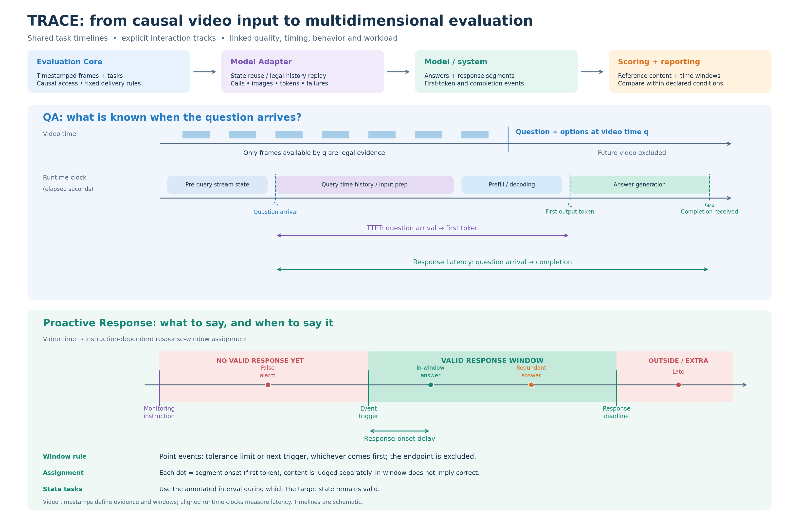
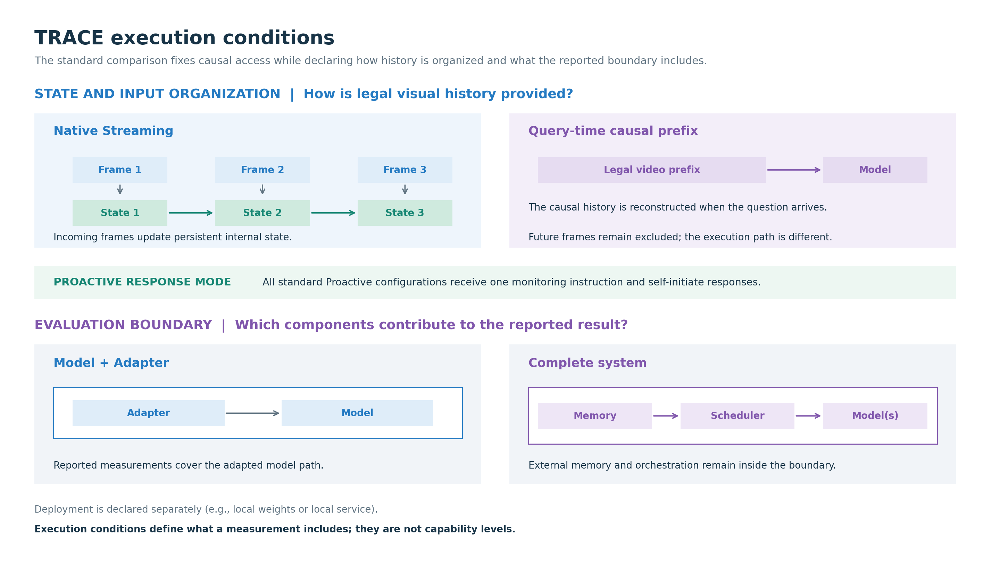
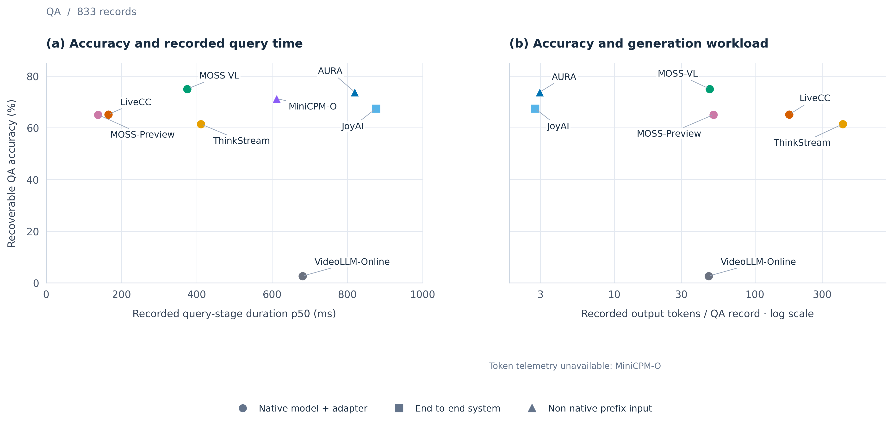
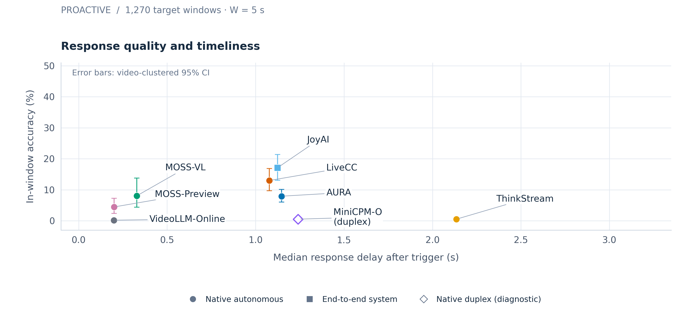
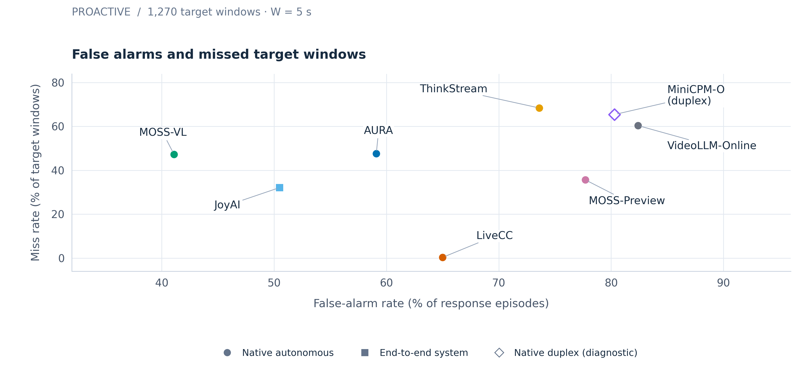

<h1>TRACE</h1>

<h3>Temporal Audit and Condition-aware Evaluation</h3>

  A reproducible local benchmark for timestamped video question answering and
  proactive responses.

  
  

  <a href="README.zh-CN.md">简体中文</a>
  · <a href="https://om-ai-lab.github.io/trace-bench/">Project page</a>
  · <a href="https://om-ai-lab.github.io/trace-bench/results/index.zh-CN.html">Leaderboard</a>
  · <a href="docs/evaluation-protocol.md">Evaluation protocol</a>
  · <a href="docs/dataset-card.md">Dataset card</a>

## 🧭 How TRACE works

TRACE connects causal video history, adapter execution, model or system
responses, telemetry and scoring in one auditable workflow.

  

<em>TRACE evaluation design — the Core → Adapter → model/system → scoring path, with QA and Proactive timelines.</em>

### Why TRACE

| | What TRACE makes explicit |
| --- | --- |
| **Temporal audit** | Timestamped RGB observations, legal history, response windows and stopping boundaries are retained with the output. |
| **Controlled execution** | The Core and Adapter separate benchmark timing from model-specific interfaces, so native and non-native integrations can be compared without hiding the boundary. |
| **Condition-aware reporting** | Quality, delay, false alarms, misses and workload are reported together for each execution condition. |

## ⚙️ Execution conditions

Execution conditions separate visual state, response triggering and the
evaluation boundary. They are comparison dimensions rather than capability
labels.

  

<em>Execution modes — native versus prefix-input visual state, autonomous versus polling response triggering, and model/Adapter versus complete-system boundaries.</em>

## 🧩 Tasks, data and protocol

TRACE evaluates two complementary behaviors:

| Task | What the model sees and what is measured |
| --- | --- |
| **QA** | A question arrives at a specified timestamp. The model receives only the legal video history and is scored with Recoverable Accuracy, completion, response latency and output validity. |
| **Proactive** | A monitoring instruction arrives before an event. The model must decide what to say and when to say it; the scorecard reports In-window Accuracy, observed median delay, False-alarm Rate and Miss Rate. |

The standard benchmark cohort contains **833 QA records and 407 Proactive
records (1,270 windows) across 517 videos**. The checked-in release also
contains the full population: 1,248 records, 522 videos and 1,338 Proactive
windows. Eight sampling-stress records are excluded from the standard cohort,
so <code>--subset full</code> covers a different population.

Source videos are downloaded separately from the upstream datasets:
[StreamingBench](https://huggingface.co/datasets/mjuicem/StreamingBench) and
[OVO-Bench](https://huggingface.co/datasets/JoeLeelyf/OVO-Bench). TRACE ships
the v1.1.0 annotations, release manifest and validation metadata, not the
source videos or model weights. Read the [dataset card](docs/dataset-card.md)
and [data terms](DATA_TERMS.md) before using them.
StreamingBench authors permit redistribution of the modified annotation files;
StreamingBench-derived TRACE additions are under CC BY-NC-SA 4.0 within the
rights held by TRACE contributors. OVO-Bench annotation terms remain unresolved.

## 📊 Benchmark results

The figures show how quality, timing and response behavior vary across
configurations. Use the scorecards and metric definitions below when comparing
results across execution conditions.

### Similar QA quality can have different execution profiles

LiveCC and MOSS-Preview are near 65% QA accuracy, yet completion, response
latency and recorded output-token totals differ. MiniCPM-O is shown as a
diagnostic because its text-interface invalid-output rate is 93.52%.

  

### Similar Proactive quality can hide different response selection

MOSS-VL and AURA reach 8.05% and 7.92% In-window Accuracy. MOSS-VL has the
lower False-alarm Rate (41.1% versus 59.1%) and a shorter observed median delay.

  

  

Explore and filter the complete results in the offline
[results explorer](docs/results-explorer.md), or read the
[full benchmark results and measurement limits](docs/benchmark-results.md).
The machine-readable result snapshot is available at
<h2>📊 Show the complete benchmark scorecards</h2>

scorecards

### QA · v1.1.0 benchmark cohort (833 records)

| Configuration | Accuracy ↑ | Completion ↑ | Response latency, median (ms) ↓ | Submitted images | Recorded output tokens | Invalid output ↓ |
| --- | ---: | ---: | ---: | ---: | ---: | ---: |
| **(a) Native models with Adapters** |  |  |  |  |  |  |
| LiveCC | 65.19% | 93.88% | 165.2 | 21,917 | 146,064 | 6.12% |
| MOSS-Preview | 65.07% | 100.00% | 138.1 | 30,835 | 42,206 | 1.92% |
| MOSS-VL | 75.03% | 99.88% | 374.6 | 30,835 | 39,768 | 0.84% |
| ThinkStream | 61.46% | 100.00% | 411.0 | 30,835 | 349,476 | 0.00% |
| VideoLLM-Online | 2.64% | 100.00% | 681.1 | 30,835 | 39,047 | 95.32% |
| MiniCPM-O (native duplex) | 2.40% | 100.00% | 489.5 | 30,835 | 24,591 | 93.52% |
| **(b) End-to-end system** |  |  |  |  |  |  |
| JoyAI | 67.47% | 91.36% | 876.1 | 17,235 | 2,286 | 8.52% |
| **(c) Non-native prefix-input** |  |  |  |  |  |  |
| AURA | 73.83% | 99.88% | 819.7 | 31,170 | 2,469 | 0.60% |

### Proactive · v1.1.0 benchmark cohort (407 records / 1,270 windows)

| Configuration | In-window Accuracy ↑ | Median delay (s) ↓ | False-alarm Rate ↓ | Miss Rate ↓ | Submitted images | Output tokens |
| --- | ---: | ---: | ---: | ---: | ---: | ---: |
| **(a) Autonomous model + Adapter** |  |  |  |  |  |  |
| LiveCC | 12.98% | 1.08 | 65.0% | 0.31% | 23,243 | 78,478 |
| AURA · persistent incremental state | 7.92% | 1.15 | 59.1% | 47.64% | 439,400 | 50,957 |
| MOSS-VL | 8.05% | 0.33 | 41.1% | 47.24% | 34,520 | 74,672 |
| MOSS-Preview | 4.45% | 0.20 | 77.7% | 35.67% | 34,520 | 193,517 |
| ThinkStream | 0.52% | 2.14 | 73.6% | 68.43% | 32,783 | 373,897 |
| VideoLLM-Online | 0.18% | 0.20 | 82.4% | 60.39% | 32,783 | 42,162 |
| MiniCPM-O (native duplex) | 0.51% | 1.24 | 80.3% | 65.43% | 32,617 | 23,636 |
| **(b) End-to-end system** |  |  |  |  |  |  |
| JoyAI | 17.08% | 1.12 | 50.5% | 32.13% | 313,658 | 797,954 |

## ▶️ Run evaluation

### Install

Tested with Python 3.10–3.12. Clone or download
[this repository](https://github.com/om-ai-lab/trace-bench), then enter its root
directory:

~~~bash
python -m venv .venv
source .venv/bin/activate
python -m pip install -e '.[dev]'
trace --help
~~~

The <code>osb</code> command remains installed as a compatibility alias of
<code>trace</code>. <code>OSB_VLM_JUDGE_*</code> environment variables are
still read as fallbacks for the <code>TRACE_VLM_JUDGE_*</code> names.

~~~bash
trace data validate --release data/releases/v1.1.0
~~~

Keep the source checkout: the wheel alone does not include annotations or
videos. Model dependencies belong in the model's own environment.

### Verify the software pipeline

This creates a synthetic video, runs QA and Proactive, validates bundles,
rescores them and checks the expected answers. No GPU or judge service is
required. The test double deliberately reads GT; this is a software check,
not a model score.

~~~bash
set -euo pipefail
python scripts/make_smoke_fixture.py --output output/smoke
trace data validate --release output/smoke/release
for task in qa proactive; do
  trace run --task "$task" --release output/smoke/release --subset tiny \
    --adapter trace_bench.adapters:TestDoubleAdapter \
    --video-root output/smoke --output "output/smoke/$task" \
    --synthetic --judge-mode exact --checkpoint-every 5
  trace bundle validate "output/smoke/$task"
  trace score "output/smoke/$task" --judge-mode exact
done
python scripts/check_smoke_results.py --output output/smoke
~~~

Expect both answer checks to pass, QA accuracy and Proactive window accuracy to
equal 1.0, zero failures, and <code>synthetic: true</code> /
<code>official_eligible: false</code>. The 12-second fixture has an answer
window aligned to default 5-second polling. Missing model telemetry is expected
here. A valid bundle alone does not prove that an answer was produced.

Results stay in ignored <code>output/</code>. The generator refuses an existing
fixture directory; use a new path consistently for another smoke run. Do not
delete prior experiment results to rerun a tutorial.

### Connect a model

1. [Prepare source videos](docs/data-setup.md) from StreamingBench and OVO-Bench.
2. Follow the [LiveCC walkthrough](docs/livecc-adapter.md), or the experimental
   [ThinkStream guide](docs/thinkstream-adapter.md).
3. For another model, implement the [adapter interface](docs/adapter-guide.md);
   the adapter can live in its own repository.
4. Run <code>tiny</code>, inspect predictions, failures and telemetry, then
   select <code>full</code>. See [scoring and resume](docs/scoring-and-results.md)
   for semantic judging.

Core delivers timestamped RGB uint8 arrays at 1 FPS through OpenCV. QA receives
the legal prefix and identical user content across models. Proactive uses
5s/10s event windows or annotated state intervals, and evidence ends at the
final strict-window boundary, clamped to source duration. Native/non-native
visual state and autonomous/polling triggering are separate comparison
dimensions; see the [evaluation protocol](docs/evaluation-protocol.md).

## 📚 Documentation and citation

- [Data and limitations](docs/dataset-card.md)
- [Release files and fields](data/releases/README.md)
- [Examples and support status](examples/README.md)
- [Evaluation protocol](docs/evaluation-protocol.md) ·
  [scoring and results](docs/scoring-and-results.md)
- [Release/version policy](docs/releasing.md) ·
  [validation](docs/release-validation.md)
- [Third-party notices](THIRD_PARTY_NOTICES.md) ·
  [contributing](CONTRIBUTING.md) · [security](SECURITY.md) ·
  [code of conduct](CODE_OF_CONDUCT.md)
- [Citation](CITATION.cff) · [changelog](CHANGELOG.md)

TRACE code is released under [MIT](LICENSE). Dataset rights and upstream
attribution are described in [DATA_TERMS.md](DATA_TERMS.md). The repository
does not host an online evaluator, and real model results require the relevant
runtime, model weights and source videos.

## 🛠️ Development checks

The two Git-based checks below require a Git checkout and must run from its
root. ZIP users can still install TRACE, run evaluations, tests and distribution
checks; clone the repository to run these maintainer checks. CI covers Python
3.10–3.13.

~~~bash
mkdir -p output
python -m pytest -q --basetemp=output/pytest
ruff check .
python scripts/check_docs.py
python scripts/check_public_files.py
python -m build --outdir output/dist
python scripts/check_distribution.py --dist output/dist --output output/distribution-check
~~~

Use fresh build/check directories when repeating distribution checks. CI
verifies synthetic answers and unpacked-source tests. GPU inference and live
semantic-judge validation are separate checks.
