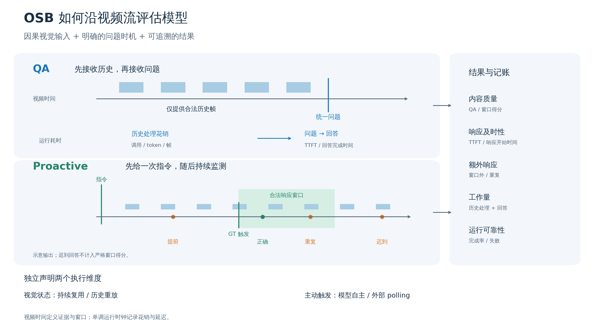

# Open Stream Bench

[English](README.md) | 简体中文

用于时间戳视频 QA 和主动响应的本地评估基准。
用户下载源视频，通过 adapter 接入模型，保存原始输出、耗时、失败和分数。
真实模型评估通常需要 GPU；OSB 不提供托管在线评估。

| 内容 | 版本与范围 |
| --- | --- |
| 软件 | `0.1.0` |
| 标注快照 | `data/releases/v1.1.0` |
| 全量数据 | 833 条 QA、415 条 Proactive；1,338 个窗口 |
| Tiny 环境检查子集 | 9 条 QA + 9 条 Proactive |
| 代码 / 数据 | [MIT](LICENSE) / [数据条款](DATA_TERMS.zh-CN.md) |

仓库仅包含 v1.1.0 标注，视频和模型权重需另行下载。
数据范围和限制见[数据卡](docs/dataset-card.zh-CN.md)。

## 任务与研究发现

QA 在指定时刻提出问题，检查模型对合法视频历史的理解；
Proactive 在事件之前给出指令，检查模型能否在视觉条件成立时主动响应。
OSB 联合报告答案质量、及时性、额外响应、工作量与执行可靠性。

### 跨任务成绩表

<table>
<thead>
<tr><th rowspan="2">模型配置</th><th colspan="2">QA · 833 条</th><th colspan="5">Proactive · 1,270 窗口</th></tr>
<tr><th>准确率 ↑</th><th>完成率 ↑</th><th>SWA ↑</th><th>TCR@5s ↑</th><th>完成率 ↑</th><th>重复响应 ↓</th><th>窗口外响应 ↓</th></tr>
</thead>
<tbody>
<tr><td colspan="8"><strong>自主响应模型 + adapter</strong></td></tr>
<tr><td>LiveCC</td><td align="right">65.19%</td><td align="right">93.88%</td><td align="right">12.98%</td><td align="right">12.51%</td><td align="right">87.71%</td><td align="right">202.4</td><td align="right">562.0</td></tr>
<tr><td>MOSS-Preview</td><td align="right">65.07%</td><td align="right">100.00%</td><td align="right">4.45%</td><td align="right">4.31%</td><td align="right">100.00%</td><td align="right">68.3</td><td align="right">503.6</td></tr>
<tr><td>MOSS-VL</td><td align="right">75.03%</td><td align="right">99.88%</td><td align="right">8.05%</td><td align="right">7.50%</td><td align="right">100.00%</td><td align="right">185.6</td><td align="right">160.2</td></tr>
<tr><td>ThinkStream</td><td align="right">61.46%</td><td align="right">100.00%</td><td align="right">0.52%</td><td align="right">0.34%</td><td align="right">100.00%</td><td align="right">3.8</td><td align="right">29.4</td></tr>
<tr><td>VideoLLM-Online</td><td align="right">2.64%</td><td align="right">100.00%</td><td align="right">0.18%</td><td align="right">0.15%</td><td align="right">100.00%</td><td align="right">5.4</td><td align="right">45.0</td></tr>
<tr><td>AURA</td><td align="right">73.83%</td><td align="right">99.88%</td><td align="right">7.92%</td><td align="right">7.39%</td><td align="right">99.26%</td><td align="right">28.4</td><td align="right">188.1</td></tr>
<tr><td colspan="8"><strong>端到端自主系统</strong></td></tr>
<tr><td>JoyAI</td><td align="right">67.47%</td><td align="right">91.36%</td><td align="right">17.08%</td><td align="right">15.18%</td><td align="right">95.58%</td><td align="right">74.6</td><td align="right">114.0</td></tr>
<tr><td colspan="8"><strong>Non-native polling 基线</strong></td></tr>
<tr><td>MiniCPM-O (polling)</td><td align="right">71.31%</td><td align="right">99.88%</td><td align="right">40.91%</td><td align="right">26.97%</td><td align="right">95.33%</td><td align="right">32.3</td><td align="right">215.8</td></tr>
</tbody>
</table>

准确率为报告的 **Recoverable Accuracy**，不是当前 Core 默认严格单标签分数。
重复和窗口外响应的单位是**每百目标窗口的次数**，不是概率。
按 Proactive 交互边界分组，不计算跨组总排名；AURA 的 QA 是 Non-native，
其 Proactive 自主输出不代表原生视觉状态已获核验。

[交互结果看板：筛选、排序与双指标比较](docs/results-explorer.zh-CN.md) ·
[完整结果、来源与测量限制](docs/benchmark-results.zh-CN.md)

本表基于保留的 v1.0.0 推理 bundle，按 v1.1.0 标准总体分析；
Proactive 为 407 条 / 1,270 个窗口、W=5s。
默认 `--subset full` 包含额外采样压力记录，不能直接与本表混比。

### 代表性发现

**相近 QA 得分可能对应不同完成率和生成量。** LiveCC 与 MOSS-Preview
准确率为 65.19% / 65.07%，完成率为 93.88% / 100%。
图中的查询阶段时间不等于端到端延迟，token 不等于跨模型计算成本。


**相近窗口得分可以隐藏不同的通知行为。** MOSS-VL 与 AURA
SWA 为 8.05% / 7.92%，重复响应相差约 6.5 倍，但 MOSS-VL 窗口外输出更少。


<details>
<summary>查看评估机制：因果输入、响应窗口与独立执行维度</summary>



机制图是协议示意，不是实际模型轨迹。
[图表来源与重新生成](docs/homepage-figures.zh-CN.md)。

</details>

## 安装

已测试 Python 3.10–3.12。克隆或下载[本仓库](https://github.com/om-ai-lab/Open-Stream-Bench)，
进入仓库根目录后执行：

```bash
python -m venv .venv
source .venv/bin/activate
python -m pip install -e '.[dev]'
osb --help
osb data validate --release data/releases/v1.1.0
```

请保留源码目录；仅安装 wheel 不包含标注和视频。模型依赖应安装在模型自己的环境中。

## 验证软件流程

以下流程生成合成视频，运行 QA 和 Proactive、校验 bundle、重新算分并检查预期答案。
无需 GPU 或 judge 服务。测试替身故意读取 GT；这是软件测试，不是模型评分。

```bash
set -euo pipefail
python scripts/make_smoke_fixture.py --output output/smoke
osb data validate --release output/smoke/release
for task in qa proactive; do
  osb run --task "$task" --release output/smoke/release --subset tiny \
    --adapter open_stream_bench.adapters:TestDoubleAdapter \
    --video-root output/smoke --output "output/smoke/$task" \
    --synthetic --judge-mode exact --checkpoint-every 5
  osb bundle validate "output/smoke/$task"
  osb score "output/smoke/$task" --judge-mode exact
done
python scripts/check_smoke_results.py --output output/smoke
```

预期两个任务的答案检查通过，QA accuracy 和 Proactive window accuracy 均为 1.0，
无失败，并标记 `synthetic: true` / `official_eligible: false`。
12 秒 fixture 的回答窗口与默认 5 秒 polling 对齐。模型遥测缺失在此测试中属于预期情况。
bundle 有效不等于模型产生了正确回答。

结果保存在被 Git 忽略的 `output/`。生成器拒绝覆盖已有 fixture；
重复验证时将所有 `output/smoke` 一致改为新的路径。不要为了重跑教程删除已有实验结果。

## 评估模型

1. 从 StreamingBench 和 OVO-Bench [准备源视频](docs/data-setup.zh-CN.md)。
2. 按 [LiveCC 教程](docs/livecc-adapter.zh-CN.md)，或实验性
   [ThinkStream 指南](docs/thinkstream-adapter.zh-CN.md)配置模型。
3. 其他模型实现 [adapter 接口](docs/adapter-guide.zh-CN.md)，可放在自己的仓库中。
4. 先跑 tiny，检查预测、失败和遥测，再跑 full。
   语义 judge、重算和续跑见[评分与续跑](docs/scoring-and-results.zh-CN.md)。

Core 使用 OpenCV 以 1 FPS 提供时间戳 RGB uint8 数组。
QA 接收合法历史，跨模型 user 内容一致。
Proactive 使用 5s/10s 事件窗口或标注状态区间，视觉输入在最后严格窗口终点结束，
源视频更短时由其长度限制。
Native/non-native 视觉状态与 autonomous/polling 触发方式是独立比较维度。
详见[评估协议](docs/evaluation-protocol.zh-CN.md)。

## 文档

- [数据及限制](docs/dataset-card.zh-CN.md)
- [Release 文件与字段](data/releases/README.zh-CN.md)
- [示例与支持状态](examples/README.zh-CN.md)
- [发布/版本规则](docs/releasing.zh-CN.md)及[验证](docs/release-validation.zh-CN.md)
- [第三方声明](THIRD_PARTY_NOTICES.zh-CN.md)、[贡献](CONTRIBUTING.zh-CN.md)、
  [安全](SECURITY.md)、[行为准则](CODE_OF_CONDUCT.md)
- [引用](CITATION.cff)及[更新记录](CHANGELOG.zh-CN.md)

## 开发检查

以下 check_docs.py 和 check_public_files.py 两个 Git 检查需要 Git checkout，
并在仓库根目录运行。ZIP 用户仍可安装、评估、运行测试和发行包检查；
需要运行这两个维护检查时请克隆仓库。CI 覆盖 Python 3.10–3.13。

```bash
mkdir -p output
python -m pytest -q --basetemp=output/pytest
ruff check .
python scripts/check_docs.py
python scripts/check_public_files.py
python -m build --outdir output/dist
python scripts/check_distribution.py --dist output/dist --output output/distribution-check
```

重复发行包检查时使用新的构建/检查目录。
CI 验证合成答案和源码包解包后的测试。GPU 推理和在线语义 judge 验证单独执行。
