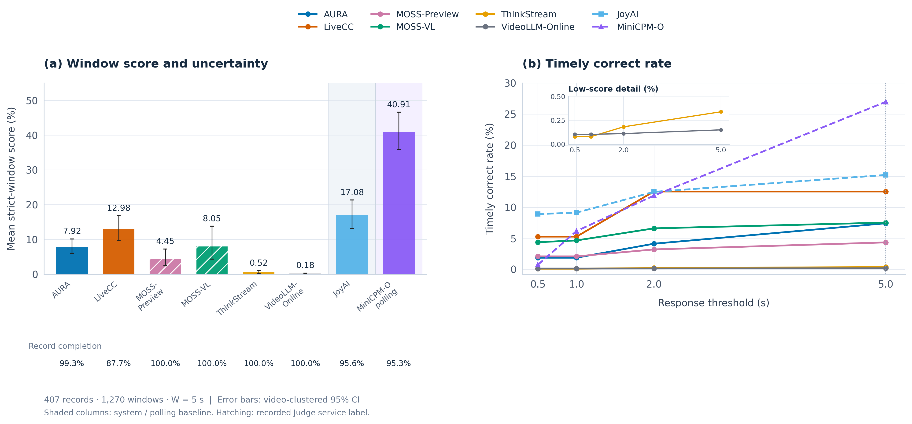
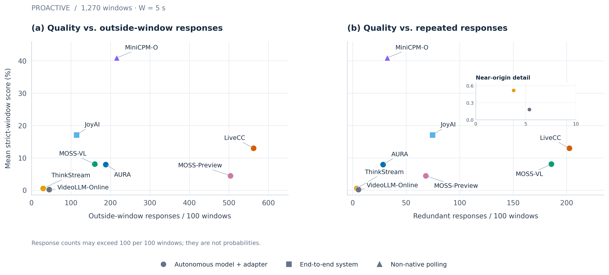

# 评估结果与核心发现

[English](benchmark-results.md) | 简体中文

也可以通过[交互成绩表与散点图](results-explorer.zh-CN.md)浏览这些结果。

本文摘编 Open Stream Bench 技术报告第三至第五章及附录 B，核对日期为 2026-09-10。
图表沿用报告选定版本；表格描述受测配置，不是混合排行榜，
也不意味着仓库已提供每个模型的 adapter。

## 任务与实验范围

| 任务 | 模型需要完成什么 | 报告使用的总体 |
| --- | --- | --- |
| 时间戳 QA | 在指定时刻接收问题，依据合法视频历史作答 | 833 条记录 / 340 个视频 |
| Proactive Response | 在事件之前接收指令，监测后续证据并自行决定响应时机 | 407 条标准记录 / 178 个视频 / 1,270 个窗口 |

Core 按真实时间节奏以 1 FPS 提供因果 RGB 观测。
点触发区分事件开始、动作完成和线索充分；状态任务使用标注区间。
失败保留在评分分母中。Proactive 采用 W=5s 评分，提前到来的下一触发点
限制当前窗口，状态区间保持不变。

**结果来源：** 报告分析基于保留的 v1.0.0 推理 bundle，
将 v1.1.0 标准总体应用于 Proactive 评分和记录级遥测；
这些不是重新执行的 v1.1.0 推理结果。
仓库发布的数据还包含 8 条采样压力记录及其 68 个窗口；
`--subset full` 会包含它们，因此其 415 条记录与本文表格总体不同。
详见 [release 字段与子集说明](../data/releases/README.zh-CN.md)。

## 评估揭示了什么

- 相近 QA 得分可以隐藏可靠性差异：LiveCC 与 MOSS-Preview 分别为
  65.19% 和 65.07%，但记录完成率分别为 93.88% 和 100%。
- 相近 Proactive 得分可以隐藏通知行为差异：MOSS-VL 与 AURA 的 SWA
  分别为 8.05% 和 7.92%，但每 100 个目标窗口产生 185.6 和 28.4 次
  重复响应，相差约 6.5 倍。
- 更高窗口得分可能伴随更多额外输出和失败：LiveCC 的 SWA 为 12.98%，
  MOSS-VL 为 8.05%；每 100 个窗口的窗口外响应分别为 562.0 和 160.2 次，
  记录完成率分别为 87.71% 和 100%。
- Polling 与自主响应衡量不同交互：MiniCPM-O 的 40.91% polling SWA
  衡量外部周期查询下的表现，不能解释为自主触发能力。
- 分触发类型的强弱可能反转：在线索充分窗口中，MOSS-Preview 为 23.54%，
  MOSS-VL 为 8.75%；在动作完成窗口中则分别为 0% 和 7.21%。
  这些子集的内容和规模不同。

这些观察支持分别报告质量、及时性、额外响应、工作量和完成率，而不是压缩成一个综合分数。

## QA 结果

下表准确率是报告的 **Recoverable Accuracy**：接受唯一明确的选项标签，
包括答案引导语和以标签开头的选项文本；拒绝两个不同标签及无标签自由文本。
解析前移除隐藏思考。它**不是软件 0.1.0 默认的严格单标签 `accuracy`**。
仅重新运行 `osb score` 不会复现这项报告分析；本次文档更新不修改 Core 解析器。

### Native 模型 + adapter

| 模型 | Recoverable accuracy | 记录完成率 | 查询阶段 p50（ms） | 记录输出 token | 无效输出 |
| --- | ---: | ---: | ---: | ---: | ---: |
| LiveCC | 65.19% | 93.88% | 165.2 | 146,064 | 6.12% |
| MOSS-Preview | 65.07% | 100.00% | 138.1 | 42,206 | 1.92% |
| MOSS-VL | 75.03% | 99.88% | 374.6 | 39,768 | 0.84% |
| ThinkStream | 61.46% | 100.00% | 411.0 | 349,476 | 0.00% |
| VideoLLM-Online | 2.64% | 100.00% | 681.1 | 39,047 | 95.32% |

### 端到端系统

| 系统 | Recoverable accuracy | 记录完成率 | 查询阶段 p50（ms） | 记录输出 token | 无效输出 |
| --- | ---: | ---: | ---: | ---: | ---: |
| JoyAI | 67.47% | 91.36% | 876.1 | 2,286 | 8.52% |

### Non-native 前缀输入

| 模型 | Recoverable accuracy | 记录完成率 | 查询阶段 p50（ms） | 记录输出 token | 无效输出 |
| --- | ---: | ---: | ---: | ---: | ---: |
| AURA | 73.83% | 99.88% | 819.7 | 2,469 | 0.60% |
| MiniCPM-O (polling) | 71.31% | 99.88% | 611.9 | N/A | 6.60% |

QA 每条记录只提问一次；“polling” 用于识别 MiniCPM-O 对应的 Proactive 配置。
完成率描述执行状态，无效输出描述答案未能解析为合法选项的情况。

查询阶段时长从记录的查询边界开始，可能不包含历史处理；它不是端到端延迟，也不是 TTFT。
输出 token 包含已记录的历史生成、思考、控制文本及答案。
缺失值不估算；词表差异及遥测覆盖不完整，使这些总量不能等同于统一计算成本或货币成本。
右图将总量除以 833 条记录，采用对数坐标；形状区分评估组别。

## Proactive 结果

Strict Window Accuracy（SWA）为窗口内容分的平均值，保留部分分。
TCR@5s 进一步要求响应开始时间满足 5 秒延迟阈值；缺少因果延迟的窗口贡献零分。
两者均保留全部 1,270 个窗口作为分母。
语义判定采用统一的 Qwen3.5-35B-A3B / `osb-vlm-judge-v1` 配置，
只输入文本，响应时机单独评分。

### 自主响应模型 + adapter

| 模型 | SWA | TCR@5s | 记录完成率 |
| --- | ---: | ---: | ---: |
| LiveCC | 12.98% | 12.51% | 87.71% |
| MOSS-VL | 8.05% | 7.50% | 100.00% |
| AURA | 7.92% | 7.39% | 99.26% |
| MOSS-Preview | 4.45% | 4.31% | 100.00% |
| ThinkStream | 0.52% | 0.34% | 100.00% |
| VideoLLM-Online | 0.18% | 0.15% | 100.00% |

“自主”描述输出触发方式，不证明视觉状态原生流式。
AURA 的 Proactive 增量状态边界仍待核验；其 QA 配置为 Non-native。

### 端到端自主系统

| 系统 | SWA | TCR@5s | 记录完成率 |
| --- | ---: | ---: | ---: |
| JoyAI | 17.08% | 15.18% | 95.58% |

JoyAI 包含记忆与调度组件，其模型级增量状态仍待核验。

### Non-native polling 基线

| 模型 | SWA | TCR@5s | 记录完成率 |
| --- | ---: | ---: | ---: |
| MiniCPM-O (polling) | 40.91% | 26.97% | 95.33% |

误差线为按视频聚类的 95% bootstrap 区间；区间重叠本身不能确立排名。
背景区分完整系统和 polling 分组。MOSS 纹理保留运行记录中的服务标签，
不表示使用了不同 Judge 模型。图中的 MiniCPM-O 均指 polling 配置。

两类横轴分别统计每 100 个目标窗口中的窗口外输出和窗口内重复输出。
次数可以超过 100，不是概率，也不是无触发视频上的一般误报率。

## 如何解释与复现

报告评估特定的模型、adapter 和系统配置。部分运行采用更长执行容差，
再统一按 W=5 重新评分，因此相同评分总体不意味着实际执行输入预算完全相同。
ThinkStream 受测配置存在末尾处理块提交限制；
JoyAI 对应受测配置，而不是完整配置下重新推理的结果。
MiniCPM-O native duplex 的语义判定不完整，未列入上述点估计表格。

线索充分子集仅有 10 个视频、48 个窗口，动作完成子集则有 319 个窗口。
Judge 校准为初步证据：分层抽样的 36 个样本中有 30 个二元判断一致，
不能视为总体可靠性保证；仅凭文本也无法核验视觉依据。

新运行请遵循[评估协议](evaluation-protocol.zh-CN.md)和
[评分说明](scoring-and-results.zh-CN.md)。
与本文比较之前，应对齐总体、答案解析器、响应窗口、触发方式和测量边界。
报告中的 Recoverable Accuracy、TCR 曲线和响应行为重建属于分析结果，
并不保证默认 CLI 输出包含完全相同的字段。
本文摘要不附带原始实验 bundle 或完整报告分析流水线。
当前公开集成见[示例与支持状态](../examples/README.zh-CN.md)。
